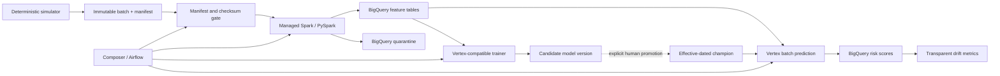

# Credit Risk Batch Scoring Platform

[](https://github.com/shree-basu/credit-risk-scoring-platform/actions/workflows/ci.yml)

A production-pattern batch data and machine-learning reference implementation for synthetic
consumer-loan credit risk. It separates matured-loan training data from current applications,
builds governed features with PySpark, evaluates logistic-regression candidates, and defines
logical-date-aware Airflow workflows for managed Spark, BigQuery, and Vertex AI.

This is decision-support engineering on synthetic data. It is not a deployed lending system,
does not approve or decline applicants, and contains no evidence of real predictive performance.

## Business contract

The platform has two deliberately separate paths:

- **Training:** application + borrower snapshot + matured outcome. The label exists only here.
- **Scoring:** application + borrower snapshot. A label cannot enter this contract.

Every batch is immutable and identified by dataset type, business date, and batch ID. Its
manifest records the exact object paths, schema version, row counts, and SHA-256 checksums.
Normal generation is local; GCS upload fails closed unless `--mode gcs --confirm-upload GCS`
is supplied.

| Entity / output | Grain or business key |
|---|---|
| `applications` | one row per `loan_id` |
| `borrower_profiles` | one `borrower_id` snapshot for the source batch |
| `loan_outcomes` | one matured outcome per `loan_id`; training only |
| training/scoring features | `(loan_id, feature_date, batch_id, feature_version)` |
| quarantine | `(run_id, business_date, loan_id, reason_code)` |
| risk scores | `(loan_id, score_date, model_version)` |
| model assignment | effective-dated model/version interval |

## Architecture



The Terraform blueprint models Managed Service for Apache Spark batch workloads rather than an
always-on Dataproc cluster. Documentation may also use the familiar names Dataproc Serverless and
Cloud Composer.

## Implementation highlights

### Source and feature engineering

- Deterministic normal, duplicate, missing-profile, invalid-value, and distribution-drift
  scenarios.
- Explicit Spark schemas; no production schema inference and no Python UDFs in feature logic.
- Derived debt, loan, payment, credit-band, and employment-stability features.
- A shared model feature allowlist excludes identity columns and `age`; age is retained only for
  synthetic audit/fairness analysis.
- Permanent duplicate-key failures plus record-level reason-coded quarantine.
- Hard reconciliation: input population equals accepted plus quarantined population.
- Execution-specific staging and transactional, same-business-key publication make retries and
  deliberate replays non-append-only.

The managed runtime contract is `2.3` (Spark 3.5.3, Python 3.11) and local Spark tests pin
PySpark 3.5.3. See [the Spark runtime notes](docs/spark-runtime.md).

### Model lifecycle

- A deterministic scikit-learn logistic-regression pipeline handles numeric and categorical
  features and records the seed, feature version, allowlist, threshold, lineage, and metrics.
- Metrics include ROC AUC, average precision, threshold precision/recall, and Brier score.
- Quality gates yield `CANDIDATE` or `REJECTED`; training cannot activate a model.
- The Vertex-compatible prediction container returns probability of default and a transparent
  risk band, never a credit decision.
- Promotion requires an explicit `PROMOTE` confirmation and creates an audited, effective-dated
  assignment. Historical scoring resolves the champion effective for its score date.
- PSI, standardized mean shift, relative standard-deviation shift, and categorical total
  variation are transparent review signals; drift does not auto-promote or auto-retrain.

See [model lifecycle and evidence boundaries](docs/model-lifecycle.md).

### Orchestration and warehouse

- `credit_risk_daily_scoring`: daily at 04:00 UTC.
- `credit_risk_periodic_retraining`: monthly at 05:00 UTC on day one.
- Both use Airflow logical dates, `catchup=True`, and `max_active_runs=1`.
- Completion-marker sensing is followed by exact manifest validation; deterministic DQ and
  reconciliation tasks do not retry.
- Managed Spark and Vertex tasks have bounded retries/timeouts and deterministic job identities.
- Retraining requires an existing parent model, registers only a candidate version, and never
  changes the default model or performs promotion.
- BigQuery schemas use explicit DATE/TIMESTAMP/NUMERIC types, time partitioning, clustering,
  retention controls, and audit/lineage columns.

See [orchestration](docs/orchestration.md) and [failure scenarios](docs/failure-scenarios.md).

### Infrastructure and cost safety

Terraform covers APIs, GCS, BigQuery, Artifact Registry, workload service accounts/IAM,
monitoring, and separately gated Composer. Checked-in defaults create **zero resources**:
`deployment_enabled=false` and `enable_composer=false`. Core creation additionally requires the
literal `DEPLOY`; Composer also requires `COMPOSER`. Destructive lifecycle protections are
enabled for persistent stores and Composer.

GitHub Actions has read-only repository permissions and contains no GCP authentication, cloud CLI,
Terraform plan/apply, image push, job submission, or deployment workflow. It only runs local tests,
static Terraform validation, and local Docker builds. Keeping this public repository on GitHub
does not deploy GCP resources. See [infrastructure safety](docs/infrastructure-safety.md).

## Validation and evidence

| Evidence level | What is covered |
|---|---|
| Implemented + locally tested | source contract, manifest/checksum validation, PySpark feature/DQ logic, reconciliation, local training, prediction HTTP contract, promotion guards, drift functions, orchestration helpers |
| Implemented + statically validated | Airflow DagBag on pinned Airflow/provider, Terraform format/init-without-backend/validate, zero-resource defaults, both Docker image builds, SHA-pinned cloud-free workflow |
| Designed but not deployed | GCS ingestion, Managed Spark batches, BigQuery execution, Artifact Registry, Vertex training/registry/batch prediction, Composer, monitoring alerts |

CI runs five independent jobs: quality, Spark tests, DagBag, Terraform static validation, and
container builds. Exact commands and the evidence boundary are in [validation evidence](docs/evidence.md).

## Safe local quick start

Python 3.11 and Java 17 are the supported development combination.

```bash
python -m venv .venv
python -m pip install -r requirements.txt
python -m pytest -q tests/test_simulator_contract.py tests/test_model_lifecycle.py
python -m data.simulator.generate_loans \
  --dataset-type scoring --partition-date 2026-09-03 \
  --batch-id scoring-20260903 --records 100 --seed 17
```

The command writes only under `data/output/`. Cloud modes are not part of the quick start. For
Spark tests, DagBag validation, replay guidance, failure recovery, and model operations, use the
[runbook](docs/runbook.md).

Optional cloud client packages are isolated in `requirements-cloud.txt`; installing them does not
authenticate or run anything, and the application confirmation gates still apply.

## Repository map

```text
data/simulator/       deterministic training/scoring source batches
spark/credit_risk/    explicit schemas, features, DQ, quarantine, I/O
bigquery/             table DDL, JSON schemas, replay-safe publication SQL
vertex/trainer/       local/Vertex-compatible candidate trainer container
vertex/predictor/     Vertex-compatible prediction container
vertex/               promotion and registry guards
monitoring/           transparent drift calculations
dags/                 daily scoring, retraining, and pure runtime helpers
infra/terraform/      zero-resource-by-default deployment blueprint
tests/                cloud-free contract, Spark, ML, orchestration, DagBag tests
scripts/              CI safety and repository policy checks
docs/                 architecture decisions, operations, evidence, limitations
```

## Explicit limitations

- No authenticated GCP execution, Terraform plan/apply, image publication, or cloud smoke test has
  been performed or claimed.
- Synthetic metrics do not establish production model quality, calibration, fairness, or business
  benefit. Independent validation, bias testing, explainability, policy review, and human controls
  are mandatory for any real lending use.
- No measured cloud scale, latency, availability, SLA, or cost claim exists.
- Drift thresholds are illustrative governance inputs, not validated production thresholds.
- Bootstrap creation of the first parent model and every promotion/decommission remain separately
  reviewed operator actions.

This repository is ready for a skeptical post-implementation audit; it is not declared
interview-ready until that review is complete.
